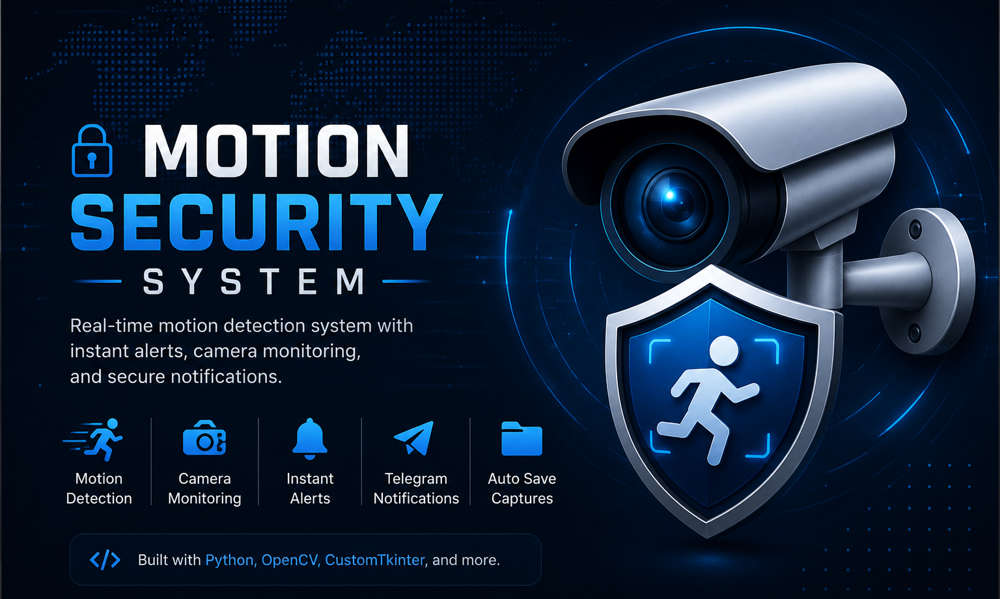
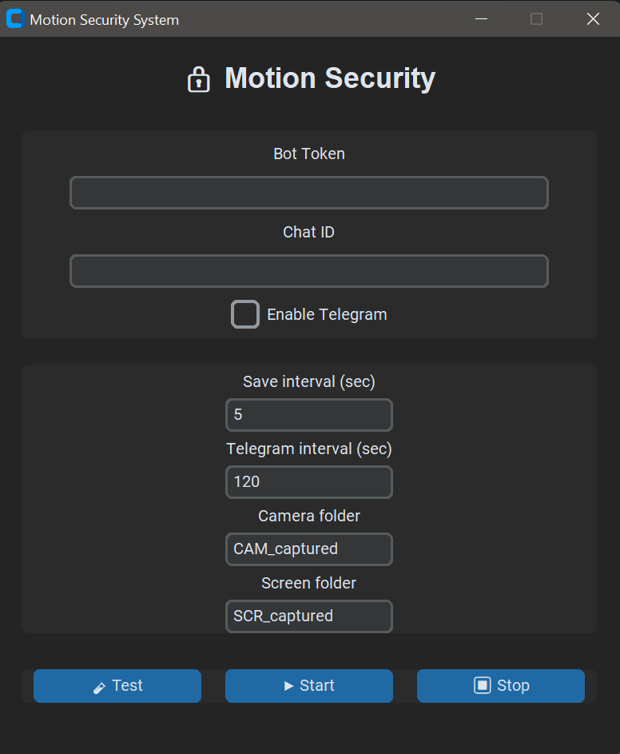
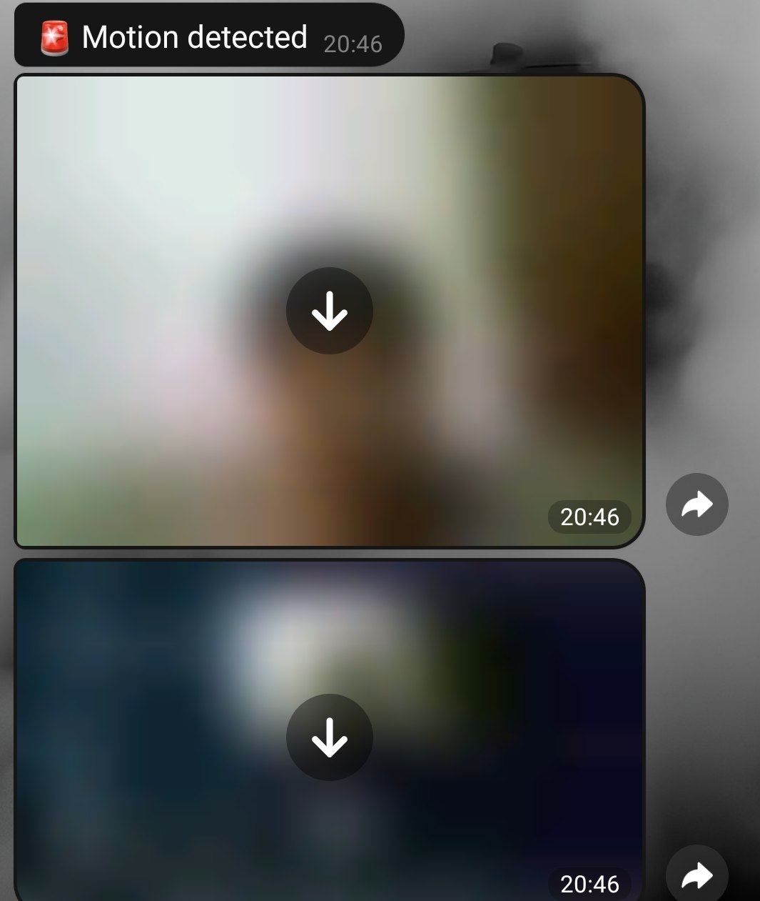

<p align="center">
  
</p>

<h1 align="center">Motion Security System</h1>

<p align="center">
A desktop motion detection system built with Python, OpenCV and CustomTkinter.
</p>
<p align="center">


</p>
# 🔒 Motion Security System

A desktop motion detection system built with **Python**, **OpenCV**, and **CustomTkinter**.

The application monitors a webcam in real time and automatically captures images whenever motion is detected. It can also take desktop screenshots and send notifications with captured images directly to Telegram.

---

## 📸 Preview




---

# ✨ Features

- 🎥 Real-time motion detection
- 📷 Automatic camera image capture
- 🖥️ Automatic desktop screenshot capture
- 🤖 Telegram notifications
- 📤 Send captured images to Telegram
- ⚙️ Configurable save interval
- ⚙️ Configurable Telegram notification interval
- 💾 Automatic configuration saving
- 📁 Custom save folders
- 🌙 Modern GUI using CustomTkinter
- 🚀 Lightweight and easy to use

---

# 🛠 Built With

- Python 3
- OpenCV
- CustomTkinter
- Requests
- PyAutoGUI
- Pillow
- JSON

---

# 📂 Project Structure

```
Motion-Security-System
│
├── motion_security.py
├── requirements.txt
├── README.md
├── LICENSE
├── .gitignore
├── config.json.example
│
├── screenshots/
│   ├── main_window.png
│   ├── telegram_alert.png
│   └── motion_detected.png
│
├── CAM_captured/
└── SCR_captured/
```

---

# ⚙️ Installation

Clone the repository

```bash
git clone https://github.com/amirjalili007/Motion-Security-System.git
```

Open the project

```bash
cd Motion-Security-System
```

Install dependencies

```bash
pip install -r requirements.txt
```

Run the application

```bash
python motion_security.py
```

---

# ⚙️ Configuration

Create a new file named:

```
config.json
```

or simply copy

```
config.json.example
```

and rename it to

```
config.json
```

Then edit the following fields:

```json
{
    "telegram_token": "",
    "telegram_chat": "",
    "telegram_enabled": false,
    "save_interval": 5,
    "telegram_interval": 120,
    "cam_folder": "CAM_captured",
    "scr_folder": "SCR_captured"
}
```

---

# 🚀 Usage

1. Enter your Telegram Bot Token.
2. Enter your Chat ID.
3. Enable Telegram notifications (optional).
4. Select folders for camera captures and screenshots.
5. Click **Start**.
6. The application will monitor motion continuously.
7. Whenever motion is detected:
   - Camera image is saved.
   - Desktop screenshot is captured.
   - Telegram notification is sent (if enabled).

---

# 📷 Screenshots

### Main Window


### Telegram Alert



---

# 📌 Future Improvements

- 🎥 Video recording
- 👤 Human detection using AI (YOLO)
- 📧 Email notifications
- ☁️ Cloud backup
- 🎞 GIF creation
- 🌐 Multi-camera support
- 📊 Event logs
- 🔐 Password protection

---

# 📜 License

This project is licensed under the MIT License.

---

# 👨‍💻 Author

**Amir Mohammad Jalili**

Computer Engineering Student

GitHub: https://github.com/amirjalili007

---

## ⭐ Support

If you found this project useful, consider giving it a ⭐ on GitHub.
